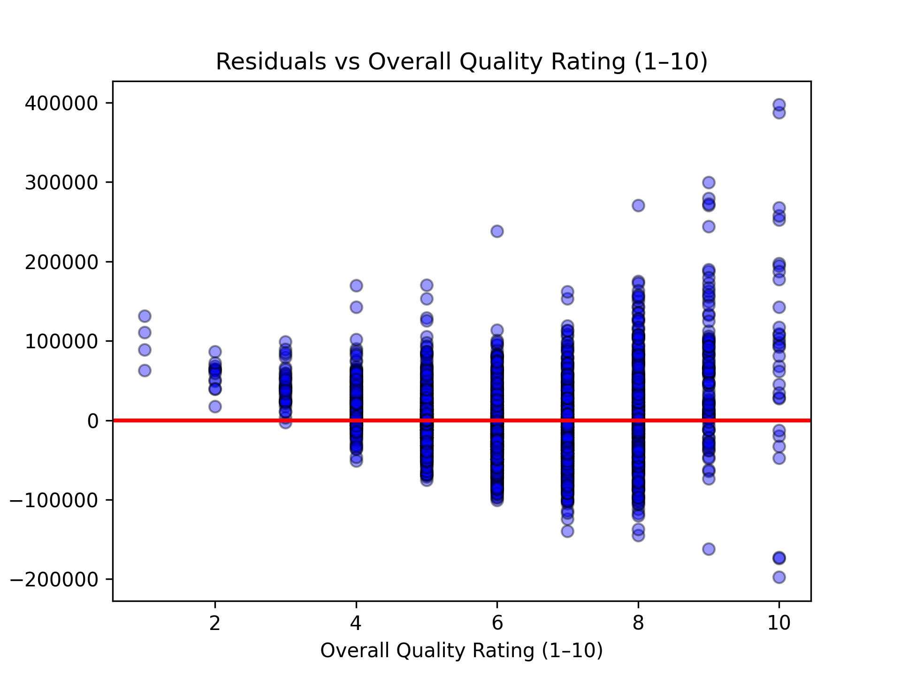
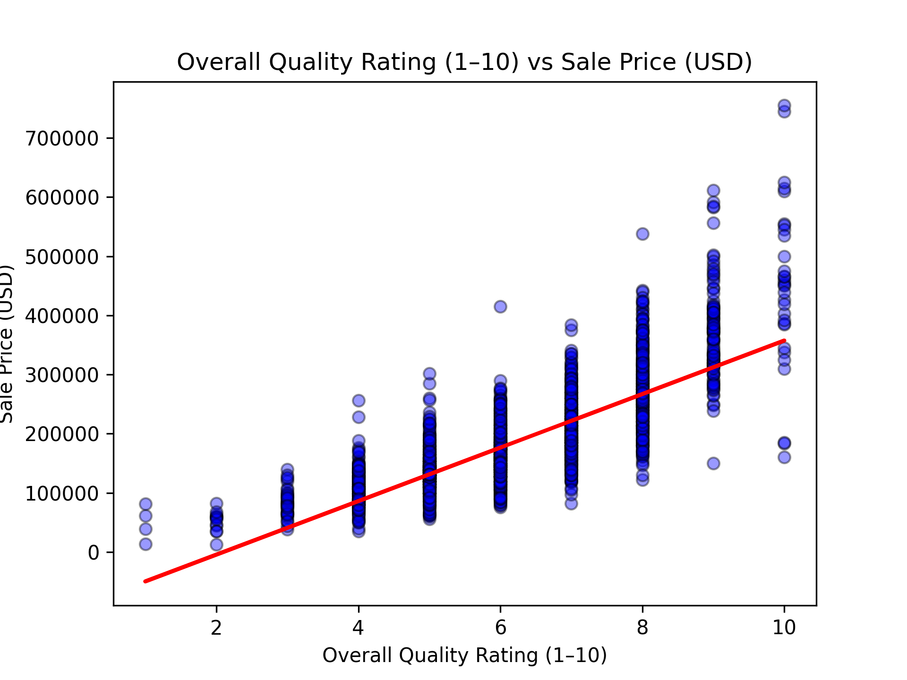
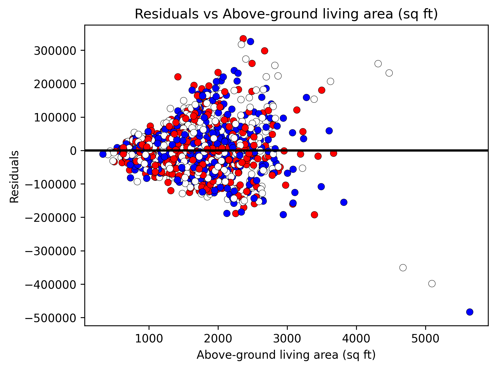
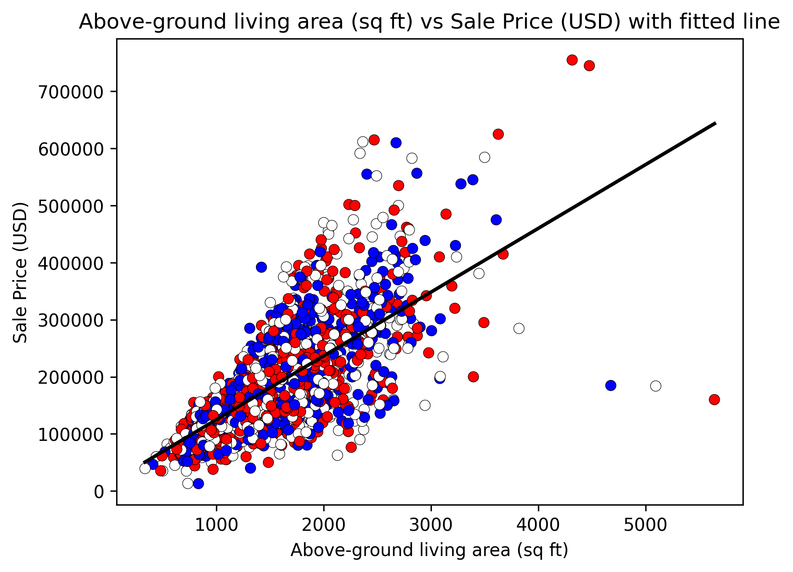

# 🏠 Ames Housing Linear Regression Analysis

[](https://denisecase.github.io/pro-analytics-02/workflow-b-apply-example-project/)
[](./pyproject.toml)
[](./LICENSE)

> Professional Python project: linear regression and predictive analytics.


## 📝 Project Overview
This project introduces the core ideas of linear regression, a fundamental statistical technique used to model relationships between variables and make predictions based on data. In simple terms, linear regression fits a straight line through a cloud of data points in a way that best represents the overall trend.

To explore these concepts in a real‑world context, this project applies simple linear regression to the well‑known Ames Housing dataset, which contains detailed information about nearly ~3,000 residential properties sold in Ames, Iowa. The goal is to understand how specific home features influence sale price and to evaluate whether a straight‑line model is an appropriate description of those relationships.

Two regressions were completed:
- ***Gr Liv Area → SalePrice***
- ***Overall Qual → SalePrice***

Each regression includes:
- A fitted-line plot
- A residual plot
- R² and RMSE metrics
- A summary of findings

These results help determine whether a straight-line model is a fair description of the relationship between each feature and home sale price.

## 📌 How to Run the Project
From the project root directory:
```shell
python src/datafun/ames_regression.py
```
This script automatically runs both regressions and saves plots to: `docs/images/`

## 📊 About the Data
The project uses the Ames Housing dataset, a well‑known real‑estate dataset containing 2,930 residential property sales from Ames, Iowa. Each row represents a single home sale, and each column describes a specific characteristic of the home.
- A few examples of the 83 available features include:
- Gr Liv Area — above‑ground living area (square feet)
- Overall Qual — overall material and finish quality (1–10)
- Year Built — year the home was constructed
- Total Bsmt SF — total basement square footage
- Garage Area — size of the garage
- SalePrice — the target variable for predicting

This dataset is widely used in data science because it contains a mix of size‑related, quality‑related, and age‑related features, making it ideal for practicing regression modeling.

## 🔧 Process Overview
This project follows a clear, repeatable workflow for performing simple linear regression:

**1. Load the dataset**:
The script loads the Ames Housing data and checks for missing values in the selected feature and target.

**2. Prepare the modeling view**:
Rows missing the chosen feature or SalePrice are removed to ensure clean, consistent input for the model.

**3. Build the feature matrix (X) and target vector (y)**
     - X contains the selected predictor (e.g., Gr Liv Area)
     - y contains the SalePrice values

**4. Fit a simple linear regression model**:
The model finds the best‑fit line that minimizes prediction error.

**5. Generate fitted values and residuals**:
- Fitted values show the model’s predicted prices
- Residuals show the difference between actual and predicted prices

**6. Compute evaluation metrics**: Two key metrics are calculated:
- **R²** — how much variation in SalePrice the model explains
- **RMSE** — average prediction error in dollars

**7. Create visualizations**: The script automatically generates:
- A scatter plot with the fitted regression line
- A residual plot to check linearity and variance

**8. Save results**:
All plots are saved to docs/images/, and a summary is printed to the terminal.
For data suggestions, please see [data/raw/README.md](data/raw/README.md).


## Command Reference

<details>
<summary>Show command reference</summary>

### In a VS Code terminal

```shell
uv self update
uv python pin 3.14
uv lock --upgrade
uv sync --extra dev --extra docs --upgrade

uvx pre-commit install

git add -A
uvx pre-commit run --all-files
# repeat if changes were made
uvx pre-commit run --all-files

# run the penguin example: is there a linear relationship?
uv run python -m datafun.app_penguins_case

# run the co2 example: is there a linear relationship?
# the line fits poorly; why?  what would you change?
uv run python -m datafun.app_co2_case

# do chores
uv run python -m pyright
uv run python -m pytest
uv run python -m zensical build

# save progress
git add -A
git commit -m "update"
git push -u origin main
```

</details>

## Script output

```shell
2026-06-21 04:16:55 | INFO | JT | === RUN START ===
2026-06-21 04:16:55 | INFO | JT | project=REGRESSION
2026-06-21 04:16:55 | INFO | JT | repo_dir=datafun-07-regression
2026-06-21 04:16:55 | INFO | JT | python=3.14.5
2026-06-21 04:16:55 | INFO | JT | os=Windows 11
2026-06-21 04:16:55 | INFO | JT | shell=powershell
2026-06-21 04:16:55 | INFO | JT | cwd=.
2026-06-21 04:16:55 | INFO | JT | github_actions=False
2026-06-21 04:16:55 | INFO | JT | Loading dataset: housing
2026-06-21 04:16:55 | INFO | JT | Loaded: 2930 rows, 83 columns
2026-06-21 04:16:55 | INFO | JT | Creating modeling view (dropping rows missing feature or target)
2026-06-21 04:16:55 | INFO | JT | Original rows: 2930
2026-06-21 04:16:55 | INFO | JT | Model rows:    2930
2026-06-21 04:16:55 | INFO | JT | Rows dropped:  0
2026-06-21 04:16:55 | INFO | JT | Building feature matrix X and target vector y
2026-06-21 04:16:55 | INFO | JT | Fitting linear regression model
2026-06-21 04:16:55 | INFO | JT | Fitted line: SalePrice = 111.694 * Gr Liv Area + 13289.6
2026-06-21 04:16:55 | INFO | JT | Computing fitted values
2026-06-21 04:16:55 | INFO | JT | R-squared: 0.4995
2026-06-21 04:16:55 | INFO | JT | RMSE: 56,504.88
2026-06-21 04:16:55 | INFO | JT | Computing residuals
2026-06-21 04:16:55 | INFO | JT | Creating scatter plot with fitted line
2026-06-21 04:16:56 | INFO | JT | Creating residual plot
2026-06-21 04:16:57 | INFO | JT | ========================
2026-06-21 04:16:57 | INFO | JT | SUMMARY
2026-06-21 04:16:57 | INFO | JT | ========================
2026-06-21 04:16:57 | INFO | JT | Dataset: housing
2026-06-21 04:16:57 | INFO | JT | Feature (x): Gr Liv Area
2026-06-21 04:16:57 | INFO | JT | Target  (y): SalePrice
2026-06-21 04:16:57 | INFO | JT | Original rows: 2930
2026-06-21 04:16:57 | INFO | JT | Model rows:    2930
2026-06-21 04:16:57 | INFO | JT | Fitted line: SalePrice = 111.694 * Gr Liv Area + 13289.6
2026-06-21 04:16:57 | INFO | JT | ========================
2026-06-21 04:16:57 | INFO | JT | === RUN START ===
2026-06-21 04:16:57 | INFO | JT | project=REGRESSION: Overall Qual vs SalePrice
2026-06-21 04:16:57 | INFO | JT | repo_dir=datafun-07-regression
2026-06-21 04:16:57 | INFO | JT | python=3.14.5
2026-06-21 04:16:57 | INFO | JT | os=Windows 11
2026-06-21 04:16:57 | INFO | JT | shell=powershell
2026-06-21 04:16:57 | INFO | JT | cwd=.
2026-06-21 04:16:57 | INFO | JT | github_actions=False
2026-06-21 04:16:57 | INFO | JT | Loading dataset: housing
2026-06-21 04:16:57 | INFO | JT | Loaded: 2930 rows, 83 columns
2026-06-21 04:16:57 | INFO | JT | Original rows: 2930
2026-06-21 04:16:57 | INFO | JT | Model rows:    2930
2026-06-21 04:16:57 | INFO | JT | Rows dropped:  0
2026-06-21 04:16:57 | INFO | JT | Fitted line: SalePrice = 45251 * Overall Qual + -95003.6
2026-06-21 04:16:57 | INFO | JT | R-squared: 0.6388
2026-06-21 04:16:57 | INFO | JT | RMSE: 48,002.35
2026-06-21 04:16:58 | INFO | JT | ========================
2026-06-21 04:16:58 | INFO | JT | SUMMARY
2026-06-21 04:16:58 | INFO | JT | ========================
2026-06-21 04:16:58 | INFO | JT | Dataset: housing
2026-06-21 04:16:58 | INFO | JT | Feature (x): Overall Qual
2026-06-21 04:16:58 | INFO | JT | Target  (y): SalePrice
2026-06-21 04:16:58 | INFO | JT | Original rows: 2930
2026-06-21 04:16:58 | INFO | JT | Model rows:    2930
2026-06-21 04:16:58 | INFO | JT | Fitted line: SalePrice = 45251 * Overall Qual + -95003.6
2026-06-21 04:16:58 | INFO | JT | ========================
```

## 📊 Visualizations and Findings

### Overall Quality vs Sale Price — Residuals

The Overall Quality vs Sale Price residual plot, shows how far the model’s predictions deviate from the actual sale prices for each quality level. When the residuals cluster evenly around zero, the model is behaving well; when they drift upward or downward for certain quality ratings, it suggests the model may be over‑ or under‑predicting for those homes. This plot helps reveal whether the linear model is fair across the full range of quality scores.

### Overall Quality vs Sale Price — Scatter Plot

Displays the direct relationship between a home’s quality rating and its sale price. The upward trend is clear and strong, showing that higher‑quality homes consistently sell for more. The spread of points widens at higher quality levels, which suggests that luxury homes vary more in price, but the overall pattern supports the use of a linear model for this feature.

### Residuals Plot

The residuals plot for the Gr Liv Area model, shows how the model’s errors behave across the full range of living area values. The pattern reveals that prediction errors grow larger for bigger homes, which indicates heteroscedasticity. This means the model fits smaller and mid‑sized homes more consistently than very large ones. The plot helps explain why this regression has lower R² and higher RMSE compared to the Overall Quality model.

### Scatter Plot with Regression Line

The scatter plot with the regression line for Gr Liv Area, illustrates how the fitted line captures the general upward trend between living area and sale price. Most points fall near the line, showing that the model captures the overall relationship, but the wider spread at larger square footage highlights the model’s limitations. This visual gives an intuitive sense of how well the model performs and where it begins to struggle.

## 🎨 Note on Color Styling
Some of the scatterplots in this project use red, white, and blue point colors. These colors were chosen purely for visual styling and aesthetic appeal. The color differences do not represent categories, groups, or additional variables in the dataset. All points carry the same meaning; the varied colors simply enhance readability and give the plots a distinctive visual identity without encoding extra information.

## Project Documentation

[docs/index.md](docs/index.md)

## Citation

[CITATION.cff](./CITATION.cff)

## License

[MIT](./LICENSE)
